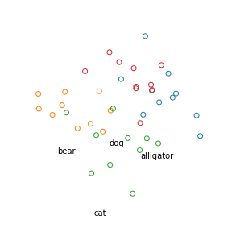
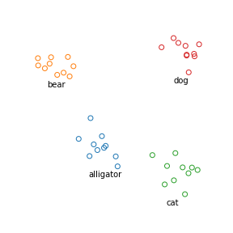
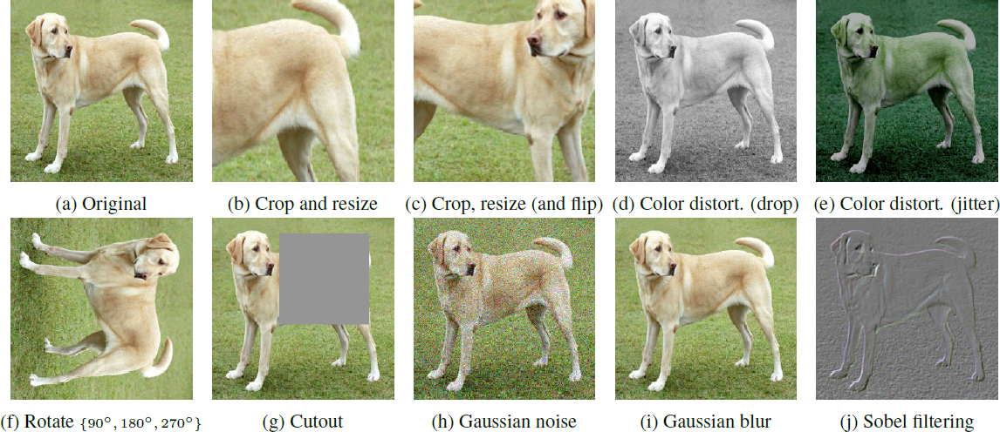
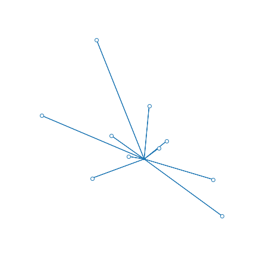
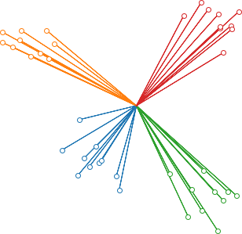
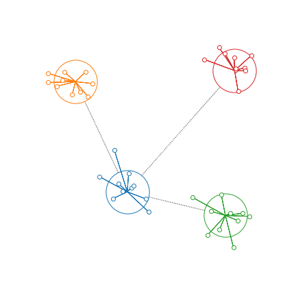


# Bootstrap your own latent (BYOL)
[Bootstrap Your Own Latent: A New Approach to Self-Supervised Learning](https://arxiv.org/abs/2006.07733)

## Self-supervised learning
- A form of unsupervised learning where the data provides the supervision
- advantage: so don't need labels
-  withhold some part of the data, and task the network with predicting it => _pretext task_
-  we usually don't care about the pretext task
-  what we care about is the intermediate representation
-  transfer learning: use that representation for real task
-  need few labels => semi-supervised learning

## Example: image classification
- suppose we want to classify pictures of animals
- classes: alligator, bear, cat, dog
- we'd like to find a _representation_ of images to make this easy (easier)
- for example, maybe we can find a mapping $x\rightarrow f_\theta(x)$ that takes an image $x$ as input and outputs a 2D point $y=f_\theta(x)$
- if we do this randomly, our representation will not be very helpful

Fig. 1 A random representation of images. Each circle corresponds to one image.

- but if we can find a good $f_\theta$ then maybe our image representations will look like this:

Fig. 2 A good representation of images

It would be easy to train a classifier to predict the animal type based on its representation. Finding a good representation is a stepping stone to the _downstream task_ of classification.

So how do we find such a representation?

## Supervised training
- if we have lots of labeled images (ones that we know are dog or cat or whatever), then there are well-developed techniques to use those to train a neural network to be able to classify an image it hasn't seen before
- this is _supervised training_ and won't be discussed further here
- other than to say that it works great if you have lots of labelled data

## Self-supervised training
- the problem discussed in this paper is where we have lots of images but only 5-10% of them are labelled
- perhaps not enough for supervised training
- can we learn a representation from the unlabelled images?
- idea: let's take one of those images and modify it a bit, several times

Fig. 3 Augmentations of a single image

- by doing this we've augmented our data set with additional images. (The paper calls each modified image an _augmented view_.)
- we don't know what class the original image came from (it's unlabelled), but we do know that all the augmented should belong to the same class
- so we tackle this _pretext task_: find a representation which has the property that all the augmented images get mapped to the same or almost the same point
- so we train a network that learns to push all augmented views from the same image to the  same point

Fig. 4 As the self-supervised network trains, it moves the representation of the augmented views of one image to a common point.

## The need for negative examples

- There's a problem with what we've done so far.
- The network can do a perfect job by mapping all images into the same point
- This is the _degenerate solution_

Fig. 5 The degenerate solution to the self-supervised task is to map all images to the same point.

- We have to change the learning task to: (1) cluster the augmented views for a single image as tightly as possible, but (2) make the clusters for views of other classes as far away as possible.
- These "other classes" are _negative examples_.

Fig. 6 Negative examples prevent collapsing to the degenerate solution. The model has to learn both to make tight clusters and to keep the clusters far apart.

## Negative examples work

- the state of the art for this is SimCLR
- you take the learned representation function $f_\theta$
- train a linear classifier on it for ImageNet
- this is an example of _transfer learning_
- use only a fraction of the ImageNet labels
- this is an example of _semi-supervised_ learning
- gets good results

## The problem with negative examples
- you need a lot of them
- it's inefficient: most examples are not very close => don't learn much
- also, how do you pick negative examples to ensure they are negative?
- the BYOL paper addresses this by doing self-supervised training _without_ requiring negative examples.
- How? Read the paper. :)

## References
- [Self-supervised learning (Zisserman)](https://project.inria.fr/paiss/files/2018/07/zisserman-self-supervised.pdf)
- [Self-Supervised Representation Learning](https://lilianweng.github.io/lil-log/2019/11/10/self-supervised-learning.html)
- [A Simple Framework for Contrastive Learning of Visual Representations](https://arxiv.org/abs/2002.05709)