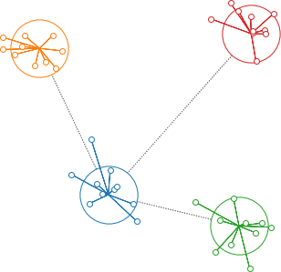


# Background for "Bootstrap your own latent (BYOL)"

The next reading group [meetup](https://www.meetup.com/LearnDataScience/events/cfkmrrybckbtb/) will discuss the paper [Bootstrap Your Own Latent: A New Approach to Self-Supervised Learning](https://arxiv.org/abs/2006.07733) (referred to in the following as just "BYOL"). We don't discuss the paper itself here but want to give some background so people not familiar with self-supervised learning can have some context and explanation of the terminology used.

We assume that the reader has a general idea about how machine learning is done, but will otherwise keep the prerequisites to a minimum. The BYOL paper advances work reported in another paper we read recently: [A Simple Framework for Contrastive Learning of Visual Representations](https://arxiv.org/abs/2002.05709). If you are comfortable with the ideas discussed there, you will probably not find much new here and should just dive right into the BYOL paper.

## Self-supervised learning

Here's the story in a nutshell. The rest of this blog post will elaborate.

_Self-supervised learning_ is a form of unsupervised learning where the data provides the supervision. (Yes, that definition is a bit self-contradictory. Just go with it.) Typically it involves withholding some part of the data and training a network to predict it.

This is called a _pretext task_ because sometimes we don't care about the task itself. Sometimes we do, but it's nice to have the flexibility to be able to use tasks that aren't obviously useful in themselves. What we care about is something we learn along the way.

    
    
<b>Fig. 1</b> Examples of self-supervised pretext tasks. (<a href="https://www.youtube.com/watch?v=7I0Qt7GALVk">src</a>) These are more oriented to natural language processing tasks than what BYOL talks about, but still, a useful summary.

The thing we learn is a _representation_ of the data. We use that for a downstream task that is the real task of interest. This is an example of _transfer learning_.

The advantage of the self-supervised learning is that we can do something useful with a data set even if only some of it is labelled.

## Example: image classification
We'll use the example of image classification because that's the end goal of the BYOL paper.

Suppose we want to classify pictures of animals: alligator, bear, cat, dog. We'd like to find a _representation_ of images to make this easy (easier). For example, a representation could be a mapping $x\rightarrow f_\theta(x)$ that takes an image $x$ as input and outputs a 2D point $y=f_\theta(x)$. (We're using two dimensions for visualization. In practice, the dimensionality would be much higher.)

If we do this randomly, our representation will not be very helpful:

    

    
<b>Fig. 2</b> A random representation of images. Each circle corresponds to one image. Different colors correspond to different classes. This is not a good representation because it doesn't help us find a way to separate the classes.

But if we can find a good $f_\theta$ then our image representations might look like this:

    

    
<b>Fig. 3</b> A good representation of images. You could separate these clusters by just drawing straight lines between them.

It would be easy to train a classifier to predict the animal class based on this representation. Finding a good representation is a stepping stone to the _downstream task_ of classification.

So how do we find such a representation?

## Supervised training
If we have lots of labeled images (ones that we know are dog or cat or whatever), then there are well-developed techniques to use those to train a neural network to be able to classify an image it hasn't seen before. This is _supervised training_ and won't be discussed further here, other than to say that it works great if you have lots of labelled data

## Self-supervised training
The problem discussed in the BYOL paper is where we have lots of images but only 5-10% of them are labelled. Can we learn a representation from the much larger number of unlabelled images?

Yup. Here's the general idea: let's take one of those images and modify it, in several different ways.

    

    
<b>Fig. 4</b> Augmentations of a single image. As humans, we can easily recognize that these images belong to the same class, but they look very different to a computer.

By doing this we have augmented our data set with additional images. (The paper calls each modified image an _augmented view_.) We don't know what class the original image came from (it's unlabelled), but we do know that all the augmented views should belong to the same class.

So we tackle this _pretext task_: find a representation which has the property that all the augmented images get mapped to the same (or almost the same point). So we train a network that learns to push all augmented views from the same image to the  same point.

    

    
<b>Fig. 5</b> As the self-supervised network trains, it moves the representation of the augmented views of one image to a common point

## The need for negative examples

There's a problem with what we've done so far. The network can do a perfect job by mapping all images into the same point. Oops. This is a _degenerate solution_ and is not useful.

    

    
<b>Fig. 6</b> The degenerate solution to the self-supervised task is to map all images to the same point.

We have to change the task to: (1) cluster the augmented views for a single image as tightly as possible, but (2) make the clusters for the other classes as far away as possible. These "other classes" are _negative examples_.

    

    
<b>Fig. 7</b> Negative examples prevent collapsing to the degenerate solution. The model has to learn both to make tight clusters and to keep clusters far apart.

## Negative examples work

The state of the art for this appraoch is [SimCLR](https://arxiv.org/abs/2002.05709). How do you assess how good it is? By testing how well it works on a downstream task, in this case, ImageNet classification.

To do this, we take the learned representation function $f_\theta$ and train a linear classifier on it for ImageNet, in the usual supervised way. This is an example of _transfer learning_. Note that during this training $f_\theta$ is frozen and will not see any labelled data.

This training uses only a fraction (for example, 1% or 5%) of the ImageNet labels. This is an example of _semi-supervised_ learning and gets good results, comparable to fully supervised training.

    

    
<b>Fig. 8</b> Semi-supervised training on just a fraction of the labels enables SimCLR to get close to the accuracy of a fully supervised model (although with many more parameters).

## The problem with negative examples
The technique of using negative examples is called _contrastive learning_. It has some drawbacks:
- You need a lot of negative examples.
- It's inefficient: most negative examples are not very close to the positive example, so you don't learn much from them.
- It's not clear how do you pick examples to ensure they are negative? After all, you don't have the labels.
- The technique is sensitive to the choice of augmentations.

The BYOL paper addresses this by doing self-supervised training _without_ requiring negative examples. How? And how do they prevent collapsing into the degenerate solution? Read the [paper](https://arxiv.org/abs/2006.07733) and come to the [meetup](https://www.meetup.com/LearnDataScience/events/cfkmrrybckbtb/) to find out!

## References
- Good overview of SSL: [Self-Supervised Representation Learning](https://lilianweng.github.io/lil-log/2019/11/10/self-supervised-learning.html)
- SimCLR: [A Simple Framework for Contrastive Learning of Visual Representations](https://arxiv.org/abs/2002.05709)
- BYOL: [Bootstrap Your Own Latent: A New Approach to Self-Supervised Learning](https://arxiv.org/abs/2006.07733)